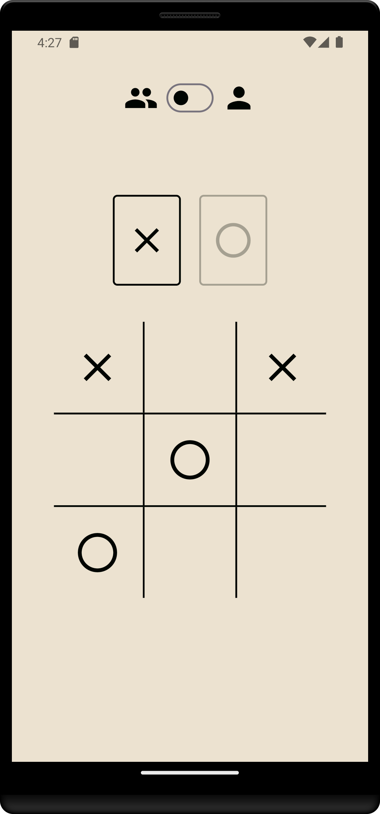
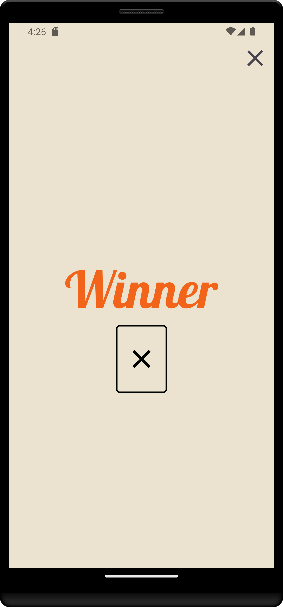
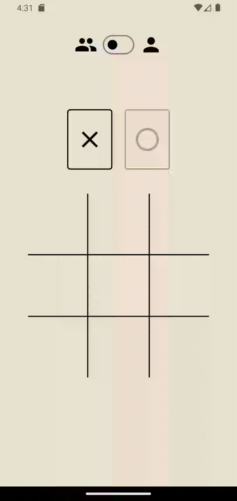

# Jogo da Velha

<h3 align="center">Tecnologias utilizadas e plataformas suportadas</h3>

## Descrição

Este projeto consiste em uma versão do jogo da velha que incorpora conceitos de **Inteligência Artificial**, mais especificamente os conceitos de **Busca e Otimização**. No modo de jogador único, foi implementado um algoritmo de *minimax*, onde **X** representa o usuário e **O** representa a **IA**. O algoritmo é responsável por tomar decisões das jogadas de **O**, buscando maximizar suas chances de vitória e minimizar as chances de vitória de **X**.

## Funcionalidade

---

## Download do APK

[Button Icon]: https://img.shields.io/badge/Download-F26419?style=flat&logoColor=black&logo=DocuSign
[Link]: https://github.com/antoniolisboa/tic_tac_toe/subscription

[][Link]

